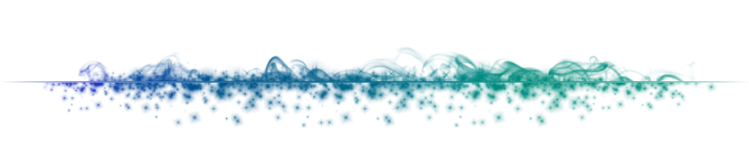

<!--  -->

<details>

[](#Installation)

<a href="#Installation"></a>

<summary> :floppy_disk: &nbsp; Installation</summary>

- ## :whale: &nbsp; Install Docker & Docker Compose

  https://docs.docker.com/get-docker/  
  https://docs.docker.com/compose/install/

- ## :closed_lock_with_key: &nbsp; Environment Variables

  Atlas MongoDB environment variables for DB mapping to include in `.env` file:

  `DEV_DB_NAME`

  `PROD_DB_NAME`

  `DB_CLUSTER`

  `DB_USER`

  `DB_PASSWORD`


- ## :wrench: &nbsp; Build and run container

  To run the container locally you can just run the `start.sh`:

  Development environment:

  ```bash
  sh start.sh -e dev
  ```

  Production environment:

  ```bash
  sh start.sh -e prod
  ```

  </details>

<br>

<details>

[](#aproach)
<a href="#aproach"></a>

  <summary> :triangular_ruler: &nbsp; Approach</summary>

- Marke it work locally :arrow_right: &nbsp; Dockerize it
- Document readme at each commit made
- External app architecture. Abstract docker commands into bash scripts
- Clear folder structure
</details>

<br>

<details>

[](#testing)
<a href="#testing"></a>

  <summary> :microscope: &nbsp; Testing</summary>

</details>

<br>

<details>

[](#cud)
<a href="#cud"></a>

  <summary> :soon: &nbsp; Currently under develop</summary>

</details>

<br>
